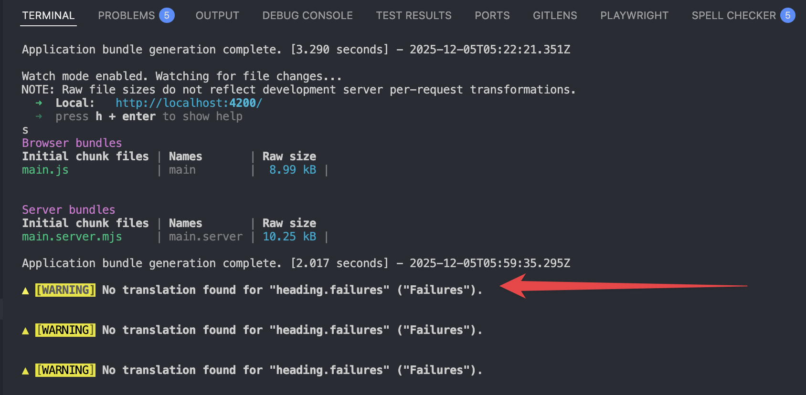

... we forget to extract translations?

---

# Angular CLI Warnings

---
layout: what-if
---

...we add, update or remove translations?

---
layout: two-cols-header
---

::left::

# Problem

- Running `npx @angular/cli extract-i18n{:bash}`, only updates `messages.xlf`
- Changes are not reflected in `messages.{lang}.xlf`

::right::

# Solution

1. Do it manually 😉
1. Use [ng-extract-i18n-merge](https://www.npmjs.com/package/ng-extract-i18n-merge)
1. Instruct an AI model
1. Combine **2. & 3.**
